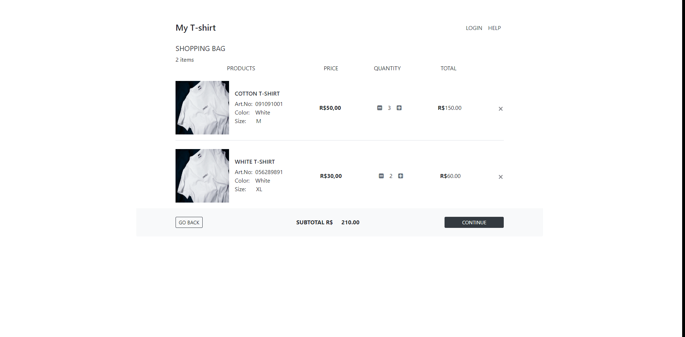

<h1 align="center"> Carrinho de compras </h1>

Cart List With JavaScript

  <a href="#-tecnologias">Tecnologias</a>&nbsp;&nbsp;&nbsp;|&nbsp;&nbsp;&nbsp;
  <a href="#-projeto">Projeto</a>&nbsp;&nbsp;&nbsp;|&nbsp;&nbsp;&nbsp;
  <a href="#-dependências">Dependências</a>&nbsp;&nbsp;&nbsp;|&nbsp;&nbsp;&nbsp;
  <a href="#memo-licença">Licença</a>&nbsp;&nbsp;&nbsp;|&nbsp;&nbsp;&nbsp;

  

 

  

## 🚀 Tecnologias

Esse projeto foi desenvolvido com as seguintes tecnologias:

- HTML e CSS
- JavaScript
- Bootstrap 4.0

## 💻 Projeto

Este é um projeto de carrinho de compras desenvolvido com JavaScript. A ideia é simular a experiência de compra online, permitindo que os usuários selecionem produtos, os adicionem a um carrinho virtual e tenham controle total sobre os itens escolhidos.

Com o carrinho de compras, você pode adicionar itens, ajustar as quantidades ou remover produtos conforme sua necessidade. O JavaScript gerencia todas essas interações de forma dinâmica, garantindo que o site responda a cada ação realizada. Além disso, o valor total da compra é calculado automaticamente, de acordo com as quantidades e preços dos produtos no carrinho.

O estado do carrinho é mantido mesmo que a página seja recarregada, graças ao uso do localStorage, que armazena os itens temporariamente no navegador.

## 🔗 Dependências

Template do projeto: https://bbbootstrap.com/snippets/bootstrap-ecommerce-cart-page-template-91851305#

Certifique-se de que todas as dependências estão corretamente instaladas usando o comando npm install após clonar o repositório.

## 📝 Licença

Esse projeto está sob a licença MIT.
